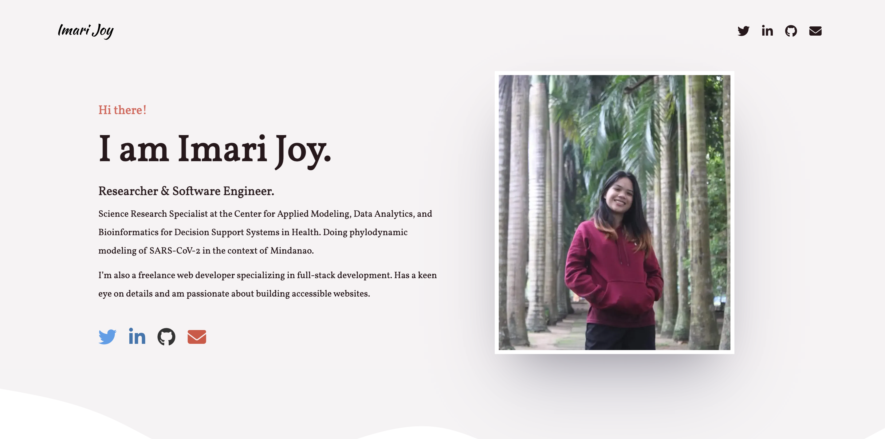

# My Portfolio

Visit [my portfolio site](http://imarijoyborda.com/) to know more about me and to see what projects I'm currently into. 

Link to my site:[http://imarijoyborda.com/](http://imarijoyborda.com/). 

## How To Use
Simply scroll down and see each section. The site is divided into 4 main sections: the `hero`, the `about me`, the `projects`, and the `services` sections.

## How It's Made
Tech used: HTML, CSS, JavaScript, and FontAwesome.

## Thanks for checking it out!