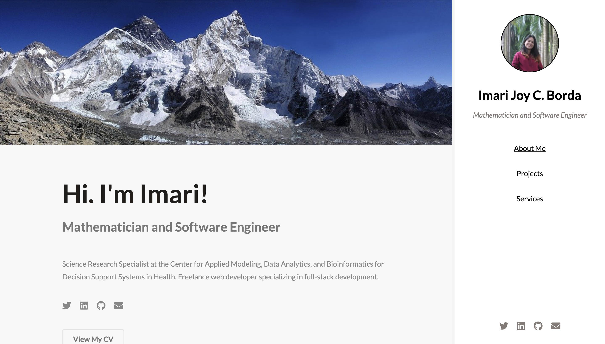

# My Portfolio

Visit [my portfolio site](http://imarijoyborda.com/) to know more about me and to see what projects I'm currently into. 

Link to my site:[http://imarijoyborda.com/](http://imarijoyborda.com/). 

## How To Use
Simply scroll down and see each section. The site is divided into 3 main sections: the `About Me`, the `Projects`, and the `Services` sections.

The banner image changes on refresh. 

## How It's Made
Tech used: HTML, CSS, and JavaScript. I also used [Pixibay API](https://pixabay.com/api/docs/) to generate random images for banner and [HTML5](https://html5up.net/) as my base template.

## Thanks for checking it out!